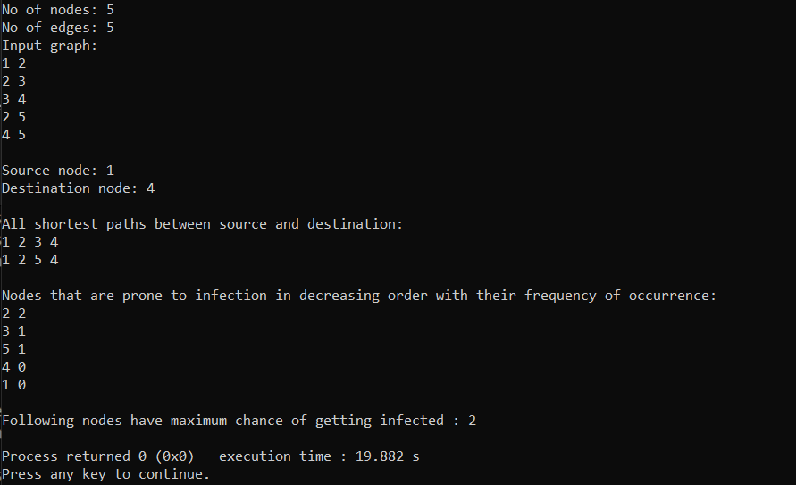

# COVID-19 INFECTION PATH DETECTION

## Language used : C++

## Algorithms used : Breadth First Search (BFS) | Quick Sort

Mentored by Prof. Partha Pratim Chakrabarti and Prof. Palash Dey of the Department of Computer Science and Engineering.
In this **Data Structures and Algorithms Project** we develop an algorithm to find the people who are most likely to get infected during the transmission of COVID-19 from a source person to a destination person.
Implemented Breadth First Search in a given social graph which is taken as input, to find and store the shortest paths and trace back the traversed nodes to determine the nodes with highest frequency of visit.

## What is a Social Graph?

Social networks illustrate the small world ideology that node encounters are adequate to build a connected relationship graph. A social graph is an appropriate tool which represents the relational structure of social networks in a natural manner. In a social graph, vertices (nodes) indicate human individuals, and edges (links) indicate transmission line between the contact points(nodes).

## Problem Statement:

Given a social graph which is undirected and unweighted, an individual (represented by a source node) who is infected by COVID-19, and a destination node (whom the infected person contacts via any of the shortest length path between them), we need to find all the nodes which are likely to get infected in the path while the infected node visits the destination node in decreasing order of how likely they are to get infected.

## Input and Output Specification

### INPUT :

In the main function,number of nodes,number of edges ,the social graph, a source node and a destination node is taken as input.

### OUTPUT:

All shortest paths from source to destination; frequency of occurrence of every node in all the shortest path between source and destination.
The node with the highest frequency is more prone to getting infected than all the other nodes. So that node is displayed as output

**Folder structure:**

- COVID-19 Infection Path Detection.pptx : Contains a Detailed powerpoint presentation about the motivation to the problem statement and the Code
- Presentation Video.mp4: Contains a video explaining the entire project including the code
- algorithm_code.cpp: Contains the C++ code for the execution of the algorithm
- sample_input.txt : Contains a sample test case.

## How to execute the code to generate output?

1. Compile the "algorithm_code.cpp" using any C++ compiler or IDE.
2. Enter the 'Number of nodes'(N) in the graph
3. Enter the 'Number of edges'(E) in the graph
4. Enter the 'Edge list', in the form of 'Pair of nodes' for 'E' number of edges. Node numbers can range from 1 to Number of nodes(N).
5. Enter the 'Source Node', which can be any node from 1 to N
6. Enter the 'Destination Node', which can be any node from 1 to N
7. The algorithm output is displayed in the format mentioned below.

**NOTE:** We can also run the following sample test case by copying the contents of the 'sample_input.txt' and pasting it as the input to the code after compiling the 'algorithm_code.cpp'

## Sample Test Case:

### Input:

No of nodes: 5  
No of edges: 5  
Input graph:  
1 2  
2 3  
3 4  
2 5  
4 5  
Source node: 1  
Destination node: 4  

### Output:

All shortest paths between source and destination:  
1 2 3 4  
1 2 5 4  

Nodes that are prone to infection in decreasing order with their frequency of occurrence:  
2 2  
3 1  
5 1  
4 0  
1 0  
Following node has maximum chance of getting infected: 2

## Snapshot

We provide the above test case input to the algorithm and the output is as follows:

  
